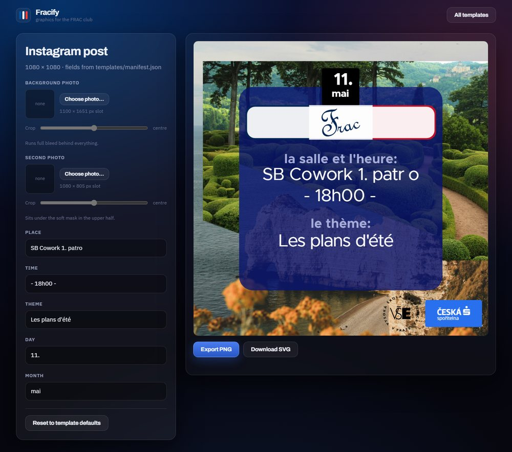

# Fracify

Fills in the FRAC club's Affinity Designer templates in the browser — type the
texts, drop in the photos, export a full-resolution PNG — so that posting to
Instagram no longer means opening Affinity.



Everything runs client side. There is no build step, no bundler and no
dependency that is not committed to this repo: `index.html`, `app.js`,
`styles.css`, the fonts and the templates are served exactly as they are.
Nothing you type or upload leaves the browser.

## The templates

Nine templates ship with it, all exported from Affinity Designer. They are the
source of truth — the app only substitutes text and swaps image data, it never
redraws artwork. The picker groups them the way the manifest says.

| Group | Template | Size | What changes |
| --- | --- | --- | --- |
| Instagram | Instagram post | 1080 × 1080 | two photos, place, time, theme, day, month |
| Instagram | Instagram story | 1080 × 1920 | two photos, place, time, theme, day, month |
| Announcement | Announcement | 1080 × 1920 | photo, a two-line message |
| Presentation | Cover | 1080 × 1080 | four separate lines |
| Presentation | Discussion 1 / 2 | 1080 × 1080 | title and three question blocks |
| Presentation | Speed dating 1 / 2 | 1080 × 1080 | title and three question blocks |
| Presentation | Vocabulary | 1080 × 1080 | title and ten French/Czech pairs |

The presentation templates share a fixed background, which is not offered for
replacement. Groups, their order and the order of the templates inside them all
come from `templates/manifest.json`; a template that names no group lands in an
"Other" section rather than disappearing.

## Running it

Any static file server will do, and so will GitHub Pages — this repo deploys
itself there from `.github/workflows/pages.yml` on every push to `main`.

Locally:

```sh
python3 -m http.server 8000        # then open http://localhost:8000/
```

A server is needed because browsers refuse to read the `templates/` folder over
`file://`; opening `index.html` straight off the disk shows an explanation
rather than failing silently.

In a container:

```sh
docker compose up -d --build       # then open http://<host>:8105/
```

The container is a static file server with a health endpoint at `/api/health`
and nothing else. It writes nothing to disk and keeps no state, so it can be
thrown away and rebuilt at any time.

| Variable | Default | Meaning |
| --- | --- | --- |
| `FRACIFY_PORT` | `8105` | host port the container is published on |
| `FRACIFY_UID` | `1000` | user id the container runs as |
| `FRACIFY_GID` | `1000` | group id the container runs as |

Every variable has a default in `compose.yml`, so the service starts without a
`.env` file. Copy `.env.example` to `.env` if you need to override one.

## What it has to work around

Affinity's SVG export is not built for substitution, and four things bite:

**Templates have no line wrapping.** Every visual line is its own `<text>` with
an absolute `x` and `y`; a longer sentence would simply run out of the box it
sits in. So a slot's lines are regenerated: the text is wrapped to the width the
slot allows, measured with `getComputedTextLength()` on a live element, and if
it still does not fit in the number of lines the design has room for, the font
size drops in 2 px steps until it does. Line spacing comes from the gap between
the original elements, not from a guess. When a field has been shrunk the form
says so, because the result is smaller than the design intends.

**Affinity bakes kerning into tspans.** A heading comes out as
`SB Co<tspan x="-127.342px -63.905px">wo</tspan>rk 1. patr<tspan x="302.516px">o</tspan>`,
where those `x` lists pin individual glyphs. Replacing just the string scatters
the letters, so an edited line is rebuilt from scratch — same `style`, same
start point, same parent transform, no tspans.

**Fonts have to travel inside the SVG.** An SVG loaded into an `` to be
drawn on a canvas is an isolated document: the page's `@font-face` rules never
reach it, and Metropolis would quietly become whatever the system offers. Before
rasterising, the faces are inlined into `<defs>` as `data:font/woff2;base64`.
See [fonts/README.md](fonts/README.md) for what is shipped and why Arial and
French Script MT are not. The "Frac" wordmark is stored as curves instead of
text, so it needs no font at all:

```sh
python3 tools/outline-logo.py --font /path/to/FRSCRIPT.TTF templates/post.svg
```

That is the same thing Affinity's "convert to curves" does on export. It only
touches the text elements set in that font, leaves the rest of the file byte for
byte alone, and never puts the font in the repo.

**Affinity flattens a translucent layer on export.** The blue panel on the post
and the story is drawn over the photos at 80 % opacity. The SVG export
rasterises it and bakes whatever happened to be behind it into the bitmap, so
the panel arrives fully opaque with a ghost of the stock photo frozen inside —
change the photo and the panel keeps showing the old one.
`tools/unflatten-panel.py` measures what the layer was, by rendering the
template once without it and fitting `baked = opacity × colour + (1 − opacity) ×
behind` over the panel's pixels, then writes the layer back as its own colour at
its own opacity. It refuses to touch a panel that does not turn out to be one
flat colour.

**The root has no pixel size.** The templates say `width="100%" height="100%"`,
which Safari renders blank or badly scaled once the file is in an ``. The
root is pinned to the `viewBox` size before anything is drawn.

A text field you have not touched keeps its original nodes untouched, so an
export made without editing anything is identical to the template, down to the
pixel. `tools/fidelity-test.py` is what proves it.

## Adding a template

Drop the SVG into `templates/` and give the app a way to find the editable
parts. Either is enough:

1. **Name the layers in Affinity.** A layer called `slot:theme` becomes a field
   named "Theme"; an image layer called `slot:photo-main` becomes a photo slot.
   Options can be appended: `slot:theme|lines=2|width=700|align=center|label=Topic`.
   Anything left out is worked out from the template itself — how wide the
   longest existing line is, and whether Affinity centred the block.
2. **Map it in `templates/manifest.json`.** For files already exported without
   slot names, a slot lists the indices of the `<text>` elements it owns, in
   document order, or the `id` of the `<image>` whose data gets replaced.

Either way, add the file to the `templates` array in the manifest so it turns up
in the picker. A template with neither slot names nor a mapping is shown as
unsupported, with the reason, rather than failing quietly.

```sh
python3 tools/check-manifest.py                # validate every mapping
python3 tools/check-manifest.py --list mots    # list a file's texts and images
python3 tools/make-thumbs.py                   # redraw the picker thumbnails
```

## Tests

```sh
pip install pillow
python3 tools/fidelity-test.py                 # all nine templates
python3 tools/fidelity-test.py post --stress   # plus a long-text pass
```

For each template, headless Chrome renders the untouched file and the same file
run through the whole pipeline, then the two PNGs are compared. Any difference
at all is a failure. `--stress` additionally renders every text slot filled with
a sentence far too long for it, which is the quickest way to see wrapping,
shrinking and overflow behave.

## Photos

A photo is cropped to fill its slot, never letterboxed, and resized to the
slot's own dimensions before being embedded — a 12 Mpx phone photo would
otherwise add a third again as much base64 to the file. Four sliders decide what
you actually see:

| Slider | Range | What it does |
| --- | --- | --- |
| X | −100…100 % | slides the crop left or right, if the framing leaves any slack |
| Y | −100…100 % | the same vertically, which portraits usually need |
| Zoom | 100…250 % | pushes in past the fill, which is what creates the slack for X and Y |
| Blur | 0…40 px | softens the photo behind the panel so the text on top stays readable |

Blur is drawn into the bitmap rather than layered over it, and the crop is
rendered with a margin of three times the radius that is thrown away afterwards,
so the faded edge a blur leaves behind never reaches the canvas. Where the
browser has no canvas `filter` — Safari before 17 — it falls back to a
downscale-and-upscale that looks the same behind a panel.

## Known quirk

The placeholder text in the post, story and announcement templates can show a
small gap where Affinity pinned a single glyph with a `tspan` — "patr o" instead
of "patro". That gap is in the exported file itself and shows up in any browser,
because the pinned position assumes the exact cut of Metropolis the designer had
installed. Typing over the field fixes it: an edited line is rebuilt without the
pinned positions.

## License

Released under the MIT License — see [LICENSE](LICENSE). The fonts keep their
own licences, listed in [fonts/README.md](fonts/README.md). The templates and
the FRAC artwork belong to the club.
